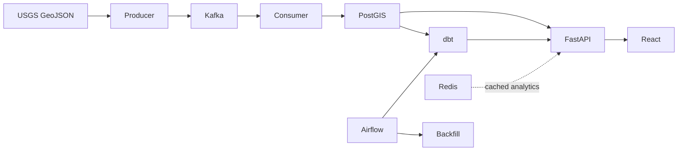

# GlobalQuake

GlobalQuake is a containerized earthquake intelligence platform built around a reliable real-time path: **USGS GeoJSON → Kafka → PostGIS → FastAPI → React**. Airflow is deliberately reserved for bounded historical backfills, dbt transformations, and quality checks rather than real-time polling.

## Quick start

```bash

docker compose up -d --build
```

Open the dashboard at `http://localhost:3000`, API documentation at `http://localhost:8000/docs`, Kafka UI at `http://localhost:8080`, and Airflow at `http://localhost:8081`.


## Architecture



Kafka topics are `earthquake.events.v1` and `earthquake.dlq.v1`. The producer keys records by the stable USGS event ID and preserves complete source features in `raw_payload`. The consumer writes first and commits a Kafka offset only after a successful transaction. Its upsert only replaces a record when an incoming `updated_time` is newer.

## Components

- **PostGIS:** `raw`, `staging`, `analytics`, and `reference` schemas; a GIST location index enables `ST_DWithin` nearby search.
- **dbt:** staging, country enrichment, fact table, and country/daily/magnitude/recent marts, including source freshness and core quality tests.
- **FastAPI:** paginated event search, detail, PostGIS nearby search, global/country/magnitude/timeline statistics, health/readiness, and live WebSocket stream.
- **React:** global Leaflet map, live-event panel, KPI cards, and Recharts visualizations.

## Commands

`make up`, `make down`, `make logs`, `make ps`, `make test`, `make dbt-run`, `make dbt-test`, and `make airflow` are provided. Run `docker compose exec postgres psql -U "$POSTGRES_USER" -d "$POSTGRES_DB"` to inspect raw records.

## Country boundaries

`reference.countries` intentionally starts empty: load a licensed, valid global polygon source (for example Natural Earth public-domain Admin 0 country data) before country enrichment is expected to return mappings. Unmapped offshore/border events remain `NULL` by design.

## Scaling and operations

The events topic has three partitions and an idempotent producer; scale consumers in the same group when partition throughput requires it. API pagination is capped at 500 rows and spatial filtering runs in PostGIS. Redis is configured for future short-lived endpoint caching and API behavior remains database-backed if it is unavailable. See `docs/` for API, data model, and architecture decisions.
